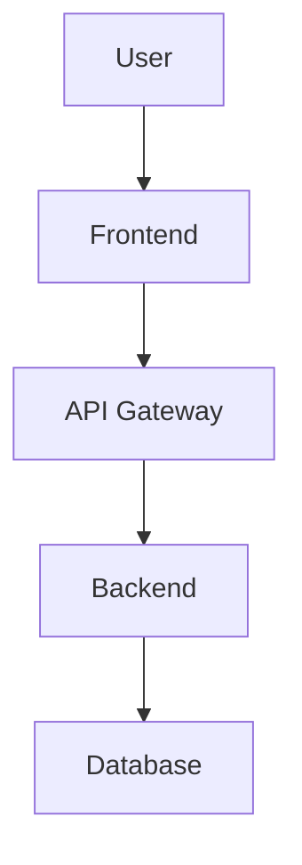

# Repo Wiki Management Skill

## 1. What Is a Repo Wiki?

A **Repository Wiki** is a built-in documentation space attached to a GitHub (or GitLab) repository. It is a **separate Git repository** from your main code repo, meaning:

- It has its own commit history.
- It can be cloned, branched, and pushed independently.
- It uses **Markdown** (`.md`) files as pages.

| Aspect         | Main Repo (`code`)          | Wiki Repo (`.wiki.git`)      |
| -------------- | --------------------------- | ----------------------------- |
| Purpose        | Source code & configs       | Documentation & guides        |
| URL            | `github.com/user/repo`      | `github.com/user/repo/wiki`   |
| Git Clone URL  | `user/repo.git`             | `user/repo.wiki.git`          |
| Branching      | Full branching model        | Typically single `master`     |
| CI/CD          | Full Actions support        | Updated via push from Actions |
| Access Control | Repo collaborators          | Same as repo (configurable)   |

### When to Use Wiki vs `docs/` Folder

| Use Wiki When...                                  | Use `docs/` Folder When...                        |
| ------------------------------------------------- | ------------------------------------------------- |
| Docs are general guides, tutorials, FAQs          | Docs must version-lock with specific code commits  |
| Non-developers need to contribute                 | You need PR reviews on doc changes                 |
| You want a browsable web interface out-of-the-box | You use a static site generator (Docusaurus, etc.) |
| Quick editing via GitHub web UI is important       | Complex folder hierarchy is needed                 |

---

## 2. Wiki Repository Structure

### 2.1 Core Files

```
repo.wiki/
├── Home.md              # Landing page (REQUIRED)
├── _Sidebar.md          # Custom navigation sidebar
├── _Footer.md           # Footer displayed on every page
├── Getting-Started.md   # Example page
├── Architecture.md      # Example page
├── API-Reference.md     # Example page
└── assets/
    └── images/
        ├── architecture-diagram.png
        └── logo.png
```

> **Important:** GitHub renders wiki pages in a **flat structure**. Even if you organize files in subfolders locally, they appear as a flat list in the web UI. Use `_Sidebar.md` to create visual hierarchy.

### 2.2 Special Files

| File             | Purpose                                           |
| ---------------- | ------------------------------------------------- |
| `Home.md`        | Default landing page when visiting the wiki        |
| `_Sidebar.md`    | Custom sidebar navigation (replaces auto-generated)|
| `_Footer.md`     | Content displayed at the bottom of every page      |

### 2.3 File Naming Convention

- Use **Title-Case-With-Hyphens** for filenames: `Getting-Started.md`, `API-Reference.md`
- Filenames become the page title and URL slug.
- Spaces in filenames are converted to hyphens in URLs.
- **All filenames must be unique** across the entire wiki (flat namespace).

---

## 3. Markdown Syntax for Wiki Pages

### 3.1 Standard GitHub Flavored Markdown (GFM)

Wiki pages support full GFM including:
- Headings (`#`, `##`, `###`)
- Bold, italic, strikethrough
- Code blocks with syntax highlighting
- Tables
- Task lists (`- [ ]`, `- [x]`)
- Alerts/Admonitions (some platforms)

### 3.2 Internal Links (Wiki-Specific)

```markdown
# Link to another wiki page
[[Page Name]]

# Link with custom text
[[Custom Link Text|Page-Name]]

# Standard Markdown link (also works)
[Link Text](Page-Name)

# Link to a heading on the same page
[Jump to Section](#section-heading-id)

# Link to a heading on another page
[Link Text](Page-Name#section-heading-id)
```

> **Anchor ID Rules:** GitHub auto-generates heading IDs by:
> 1. Converting to lowercase
> 2. Replacing spaces with hyphens
> 3. Removing punctuation
>
> Example: `## API Reference & Guide` → `#api-reference--guide`

### 3.3 Embedding Images

```markdown
# From the assets folder in your wiki repo


# External image

```

### 3.4 Table of Contents

Some wiki engines support auto-generated TOC:

```markdown
<!-- Auto TOC (GitLab wikis) -->
[[_TOC_]]

<!-- Manual TOC -->
## Table of Contents
- [Getting Started](#getting-started)
- [Architecture](#architecture)
- [API Reference](#api-reference)
```

---

## 4. Sidebar & Footer Templates

### 4.1 `_Sidebar.md` Template

```markdown
# 📚 Documentation

### 🏠 General
- [[Home]]
- [[Getting Started]]
- [[FAQ]]

### 🏗️ Architecture
- [[System Overview]]
- [[Authentication Flow]]
- [[Database Schema]]

### 🔌 API
- [[API Reference]]
- [[Endpoints]]
- [[Error Codes]]

### 🚀 Deployment
- [[Docker Setup]]
- [[CI/CD Pipeline]]
- [[Environment Variables]]

### 📊 Operations
- [[Monitoring]]
- [[Troubleshooting]]
- [[Changelog]]

---
_Last updated: 2026-05-02_
```

### 4.2 `_Footer.md` Template

```markdown
---
📖 [Main Repository](https://github.com/user/repo) |
🐛 [Report Issue](https://github.com/user/repo/issues/new) |
📧 [Contact](mailto:team@example.com)

> This wiki is maintained by the project team. Contributions welcome!
```

---

## 5. Git Operations for Wiki

### 5.1 Clone the Wiki

```bash
# Clone wiki as a separate repo
git clone https://github.com/<user>/<repo>.wiki.git

# Navigate into it
cd <repo>.wiki
```

### 5.2 Create/Edit Pages Locally

```bash
# Create a new page
echo "# New Feature Guide" > New-Feature-Guide.md

# Edit existing page
code Home.md   # Open in VS Code
```

### 5.3 Add Assets (Images, Diagrams)

```bash
# Create assets directory
mkdir -p assets/images

# Copy images
cp ~/diagrams/architecture.png assets/images/

# Reference in Markdown:
# 
```

### 5.4 Commit & Push

```bash
git add .
git commit -m "docs: add New Feature Guide page"
git push origin master
```

### 5.5 Pull Latest Changes

```bash
# If others have edited via the web UI
git pull origin master
```

---

## 6. CI/CD Automation with GitHub Actions

### 6.1 Auto-Sync Docs to Wiki

This workflow automatically pushes content from a `wiki/` folder in your main repo to the wiki repository whenever changes are merged to `main`.

```yaml
# .github/workflows/sync-wiki.yml
name: Sync Wiki

on:
  push:
    branches: [main]
    paths:
      - 'wiki/**'

jobs:
  sync-wiki:
    runs-on: ubuntu-latest
    steps:
      - name: Checkout main repo
        uses: actions/checkout@v4

      - name: Checkout wiki repo
        uses: actions/checkout@v4
        with:
          repository: ${{ github.repository }}.wiki
          path: wiki-repo
          token: ${{ secrets.WIKI_PAT }}

      - name: Sync wiki content
        run: |
          # Clear old wiki content (preserve .git)
          find wiki-repo -maxdepth 1 -not -name '.git' -not -name '.' -exec rm -rf {} +

          # Copy new content
          cp -r wiki/* wiki-repo/

          # Commit and push
          cd wiki-repo
          git config user.name "github-actions[bot]"
          git config user.email "github-actions[bot]@users.noreply.github.com"

          git add .
          if git diff --cached --quiet; then
            echo "No wiki changes to commit"
          else
            git commit -m "docs: auto-sync wiki from main repo [skip ci]"
            git push origin master
          fi
```

### 6.2 Auto-Generate API Docs to Wiki

```yaml
# .github/workflows/api-docs-to-wiki.yml
name: Generate API Docs

on:
  push:
    branches: [main]
    paths:
      - 'backend/app/routers/**'
      - 'backend/app/main.py'

jobs:
  generate-docs:
    runs-on: ubuntu-latest
    steps:
      - uses: actions/checkout@v4

      - name: Setup Python
        uses: actions/setup-python@v5
        with:
          python-version: '3.11'

      - name: Install dependencies
        run: |
          cd backend
          pip install -r requirements.txt

      - name: Generate OpenAPI spec
        run: |
          cd backend
          python -c "
          from app.main import app
          import json
          spec = app.openapi()
          with open('../wiki/API-Reference.md', 'w') as f:
              f.write('# API Reference\n\n')
              f.write('> Auto-generated from OpenAPI spec\n\n')
              for path, methods in spec['paths'].items():
                  for method, details in methods.items():
                      f.write(f'## \`{method.upper()} {path}\`\n\n')
                      f.write(f'{details.get(\"summary\", \"No summary\")}\n\n')
                      if 'parameters' in details:
                          f.write('| Parameter | Type | Required |\n')
                          f.write('|-----------|------|----------|\n')
                          for p in details['parameters']:
                              f.write(f'| {p[\"name\"]} | {p.get(\"schema\",{}).get(\"type\",\"any\")} | {p.get(\"required\",False)} |\n')
                      f.write('\n---\n\n')
          "

      - name: Push to wiki
        run: |
          git clone https://x-access-token:${{ secrets.WIKI_PAT }}@github.com/${{ github.repository }}.wiki.git wiki-repo
          cp wiki/API-Reference.md wiki-repo/
          cd wiki-repo
          git config user.name "github-actions[bot]"
          git config user.email "github-actions[bot]@users.noreply.github.com"
          git add .
          git diff --cached --quiet || (git commit -m "docs: auto-update API reference" && git push)
```

### 6.3 Authentication Setup

To push to the wiki from GitHub Actions, you need a **Personal Access Token (PAT)**:

1. Go to **GitHub → Settings → Developer Settings → Personal Access Tokens → Fine-grained tokens**
2. Create a token with **Repository permissions:**
   - `Contents: Read and Write` (for the wiki repo)
3. Add the token as a repository secret:
   - Go to **Repo → Settings → Secrets → Actions**
   - Name: `WIKI_PAT`
   - Value: `ghp_xxxxxxxxxxxx`

---

## 7. Wiki Page Templates

### 7.1 Feature Documentation Template

```markdown
# Feature Name

## Overview
Brief description of what this feature does and why it exists.

## User Story
> As a [role], I want to [action], so that [benefit].

## Architecture


### Components Involved
| Component | Role | File |
|-----------|------|------|
| Frontend  | UI   | `src/components/Feature.jsx` |
| Backend   | API  | `backend/app/routers/feature.py` |
| Database  | Data | `Firestore: users/{uid}/features` |

## API Endpoints

### `GET /api/feature`
- **Auth:** Required (Bearer token)
- **Response:** `200 OK`
```json
{
  "data": [],
  "total": 0
}
```

## Configuration
| Env Variable      | Default | Description          |
| ----------------- | ------- | -------------------- |
| `FEATURE_ENABLED` | `true`  | Toggle feature on/off |

## Known Issues
- [ ] Issue #123: Edge case when...
- [x] Issue #100: Fixed in v1.2.0
```

### 7.2 Troubleshooting Page Template

```markdown
# Troubleshooting Guide

## Common Issues

### ❌ Problem: [Error Description]
**Symptoms:**
- Error message: `TypeError: Cannot read property...`
- Occurs when: [trigger condition]

**Root Cause:**
[Explanation of why this happens]

**Solution:**
```bash
# Step 1: Check configuration
cat .env | grep FEATURE

# Step 2: Restart service
docker compose restart api
```

**Prevention:**
- Always validate inputs before...

---

### ❌ Problem: [Another Issue]
...
```

### 7.3 Architecture Decision Record (ADR) Template

```markdown
# ADR-001: [Decision Title]

**Status:** Accepted | Proposed | Deprecated
**Date:** 2026-05-02
**Decision Makers:** @user1, @user2

## Context
What is the problem or situation that requires a decision?

## Decision
What decision was made?

## Alternatives Considered
| Option | Pros | Cons |
|--------|------|------|
| Option A | Fast, Simple | Limited scalability |
| Option B | Scalable | Complex setup |
| **Option C (chosen)** | **Balanced** | **Moderate effort** |

## Consequences
- ✅ Positive: [benefit]
- ⚠️ Risk: [potential issue]
- 📋 Action: [follow-up task]
```

---

## 8. Best Practices

### 8.1 Content Guidelines

1. **Keep pages focused** — One topic per page, link between them.
2. **Use consistent formatting** — Standardize heading levels, code blocks, tables.
3. **Write for your audience** — Separate developer docs from user guides.
4. **Keep it current** — Stale docs are worse than no docs. Set review reminders.
5. **Use templates** — Maintain consistency across all documentation pages.

### 8.2 Naming & Organization

1. **Prefix pages by category** when the wiki grows large:
   - `Architecture-System-Overview.md`
   - `Architecture-Auth-Flow.md`
   - `API-Endpoints.md`
   - `API-Error-Codes.md`
2. **Always maintain `_Sidebar.md`** — This is the primary navigation tool.
3. **Use descriptive filenames** — They become page titles automatically.

### 8.3 Asset Management

1. **Store images in `assets/images/`** inside the wiki repo.
2. **Optimize images** before committing (use PNG for diagrams, JPEG for screenshots).
3. **Never commit large binary files** — The wiki is a Git repo and will bloat.
4. **Use Mermaid diagrams** in Markdown instead of image files when possible:

```markdown

```

### 8.4 Security

1. **Never put secrets** (API keys, passwords, tokens) in wiki pages.
2. **Review access settings** — Wiki inherits repo permissions by default.
3. **For public repos** — Consider restricting wiki edit access to collaborators only.

---

## 9. Suggested Wiki Structure for Portfolio Assets Management

Based on this project's architecture, here is a recommended wiki structure:

```
Home.md                          # Project overview, quick links
_Sidebar.md                      # Navigation menu
_Footer.md                       # Links to repo, issues, contact

Getting-Started.md               # Setup guide for new developers
Environment-Setup.md             # .env configuration, Docker setup

Architecture-Overview.md         # System diagram, tech stack
Architecture-Frontend.md         # React + Vite structure
Architecture-Backend.md          # FastAPI structure, routers, services
Architecture-Database.md         # Firestore schema, collections

API-Endpoints.md                 # Full API reference
API-Authentication.md            # JWT flow, Firebase Auth
API-Error-Codes.md               # Standard error responses

Features-Portfolio-Dashboard.md  # Dashboard components, charts
Features-Price-Service.md        # Price fetching logic, sources
Features-Snapshot-Engine.md      # Daily snapshots, backfill
Features-Asset-Classification.md # Asset types, categories

Deployment-Docker.md             # Docker build & run
Deployment-Cloud-Run.md          # GCP deployment guide
Deployment-Environment-Vars.md   # All env vars documented

Operations-Monitoring.md         # Health checks, logging
Operations-Troubleshooting.md    # Common issues & fixes
Operations-Scheduler.md          # Daily cron jobs, tasks

ADR/                             # Architecture Decision Records
  ADR-001-Firebase-Over-SQL.md
  ADR-002-Asset-Class-Model.md

Changelog.md                     # Version history
```

---

## 10. Quick Command Reference

| Task                        | Command                                                         |
| --------------------------- | --------------------------------------------------------------- |
| Clone wiki                  | `git clone https://github.com/user/repo.wiki.git`               |
| Create page                 | `echo "# Title" > Page-Name.md`                                 |
| Add sidebar                 | `echo "- [[Home]]" > _Sidebar.md`                               |
| Add footer                  | `echo "---\nFooter content" > _Footer.md`                       |
| Push changes                | `git add . && git commit -m "docs: update" && git push`         |
| Preview locally             | Use VS Code Markdown preview or `grip` (GitHub renderer)        |
| Check wiki URL              | `https://github.com/user/repo/wiki`                             |
| Enable wiki                 | Repo → Settings → Features → ☑ Wikis                           |
| Restrict editing            | Repo → Settings → Features → ☐ Allow all users to edit wiki    |
| Search wiki                 | Use GitHub search with `repo:user/repo` filter in wiki tab      |
