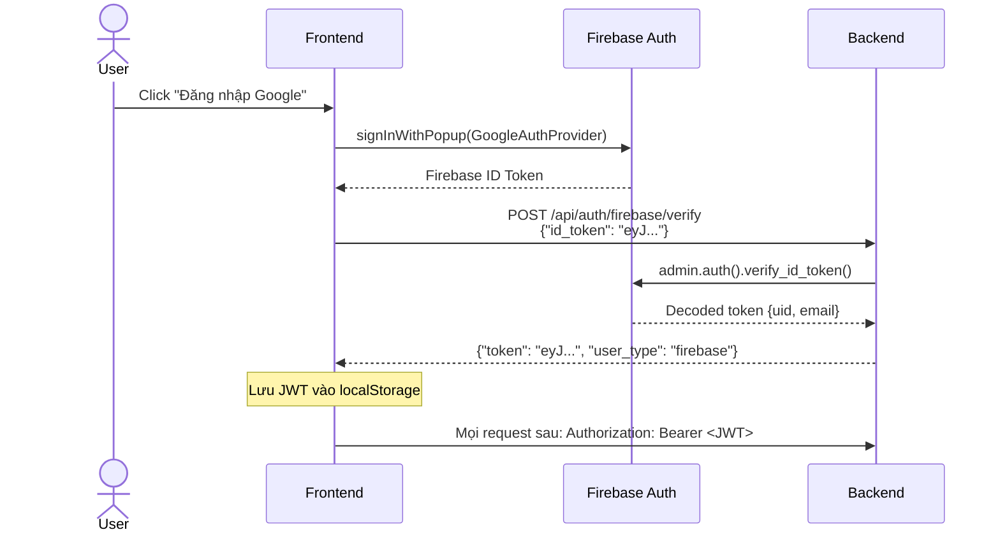
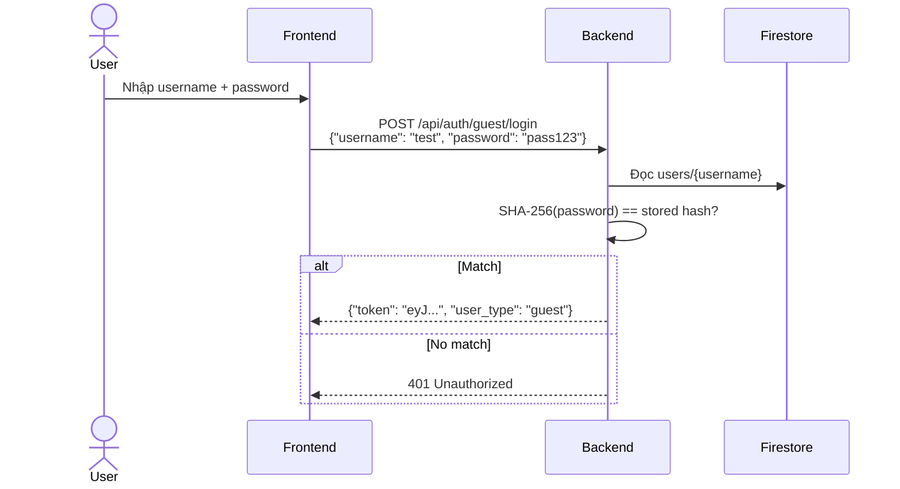
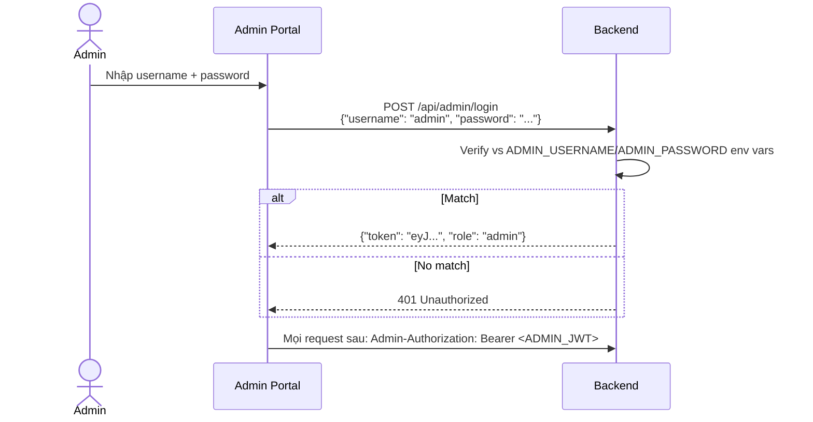

# 🔐 API Authentication — Luồng xác thực

## Tổng quan

Hệ thống hỗ trợ **3 loại xác thực** song song:

| Loại | Đối tượng | Collection | JWT Secret |
|------|-----------|-----------|------------|
| **Firebase Auth** | User chính thức | `system_users/{uid}` | Firebase ID Token |
| **Guest Auth** | User khách | `guest_users/{uid}` | `JWT_SECRET` |
| **Admin Auth** | Quản trị viên | _(không có data riêng)_ | `ADMIN_JWT_SECRET` |

## 1. Firebase Auth Flow



**JWT Payload (Firebase user):**
```json
{
  "user_id": "abc123xyz",
  "user_type": "firebase",
  "exp": 1735689600
}
```

## 2. Guest Auth Flow



**Password Storage:**
- Password được hash bằng **SHA-256** trước khi lưu vào Firestore
- So sánh hash khi login, **không bao giờ** lưu plaintext

**JWT Payload (Guest user):**
```json
{
  "user_id": "testuser",
  "user_type": "guest",
  "exp": 1735689600
}
```

## 3. Admin Auth Flow



**Đặc biệt:**
- Admin JWT dùng `ADMIN_JWT_SECRET` riêng (khác `JWT_SECRET` của user)
- Admin JWT hết hạn sau **8 giờ** (ngắn hơn user 72 giờ)
- Header dùng `Admin-Authorization` thay vì `Authorization`

## Data Isolation

Hệ thống đảm bảo **cô lập hoàn toàn** dữ liệu giữa các user:

```
Firestore
├── guest_users/
│   ├── user_a/         ← User A chỉ thấy data này
│   │   ├── transactions/
│   │   └── dailySnapshots/
│   └── user_b/         ← User B chỉ thấy data này
│       ├── transactions/
│       └── dailySnapshots/
│
└── system_users/
    └── firebase_uid/   ← Firebase user chỉ thấy data này
        ├── transactions/
        └── dailySnapshots/
```

- Backend trích `user_id` và `user_type` từ JWT token
- Mọi Firestore query đều scope theo `{user_type}_users/{user_id}/`
- Firestore Security Rules chặn client SDK — chỉ Admin SDK (backend) mới ghi được

## JWT Configuration

| Setting | Default | Mô tả |
|---------|---------|--------|
| `JWT_SECRET` | _(phải thay đổi)_ | Secret key cho user JWT |
| `JWT_ALGORITHM` | `HS256` | Thuật toán ký |
| `JWT_EXPIRE_HOURS` | `72` | Hết hạn sau 72 giờ |
| `ADMIN_JWT_SECRET` | _(phải thay đổi)_ | Secret key cho admin JWT |
| `ADMIN_JWT_EXPIRE_HOURS` | `8` | Hết hạn sau 8 giờ |

> ⚠️ **Bảo mật:** `JWT_SECRET`, `ADMIN_JWT_SECRET`, và `CRON_AUTH_KEY` phải là **3 giá trị khác nhau**.

---

## Xem thêm

- [[API Reference]] — Danh sách endpoints
- [[Architecture Database]] — Firestore schema
- [[Environment Variables]] — Cấu hình biến môi trường
