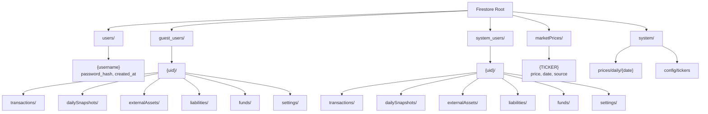

# 🗄️ Architecture Database — Firestore Schema

## Tổng quan

Dự án sử dụng **Firebase Firestore** (NoSQL document database) với kiến trúc phân tách dữ liệu theo user type.

## Collections Map



## Chi tiết Collections

### 1. `users/` — Guest Auth Credentials

| Field | Type | Mô tả |
|-------|------|--------|
| `password_hash` | string | SHA-256 hash của password |
| `created_at` | timestamp | Ngày đăng ký |

> Document ID = username (unique)

### 2. `guest_users/{uid}/` & `system_users/{uid}/` — User Data

Cả hai có cấu trúc sub-collections **giống nhau**:

#### `transactions/`

| Field | Type | Mô tả |
|-------|------|--------|
| `ticker` | string | Mã chứng khoán/crypto (VCB, BTC, VNĐ) |
| `type` | string | `buy`, `sell`, `deposit`, `withdrawal` |
| `quantity` | number | Số lượng |
| `price` | number | Giá mỗi đơn vị (VNĐ) |
| `total` | number | Tổng giá trị (VNĐ) |
| `fee` | number | Phí giao dịch |
| `date` | string | Ngày giao dịch (YYYY-MM-DD) |
| `note` | string | Ghi chú |
| `fund` | string | Quỹ liên kết (nếu có) |
| `assetType` | string | `stock`, `crypto`, `fund`, `bond`, `gold`, `cash` |
| `created_at` | timestamp | Thời điểm tạo |

#### `dailySnapshots/{date}`

| Field | Type | Mô tả |
|-------|------|--------|
| `totalValue` | number | Tổng giá trị danh mục (VNĐ) |
| `totalCost` | number | Tổng vốn đầu tư |
| `netCapital` | number | Vốn ròng (deposits - withdrawals) |
| `unrealizedPnL` | number | Lãi/lỗ chưa thực hiện |
| `realizedPnL` | number | Lãi/lỗ đã thực hiện |
| `netWorth` | number | Giá trị ròng (assets - liabilities) |
| `externalTotal` | number | Tổng tài sản ngoài danh mục |
| `liabilitiesTotal` | number | Tổng nợ |
| `holdings` | map | Chi tiết từng vị thế |
| `assetClassBreakdown` | map | Phân bổ theo loại tài sản |
| `timestamp` | timestamp | Thời điểm chụp |

#### `externalAssets/`

| Field | Type | Mô tả |
|-------|------|--------|
| `name` | string | Tên tài sản (TOPI, Tiết kiệm ACB) |
| `value` | number | Giá trị (VNĐ) |
| `category` | string | Danh mục (savings, deposit, real_estate) |
| `note` | string | Ghi chú |

#### `liabilities/`

| Field | Type | Mô tả |
|-------|------|--------|
| `name` | string | Tên khoản nợ |
| `value` | number | Số tiền nợ (VNĐ) |
| `category` | string | Loại nợ (bank_loan, credit_card) |
| `interestRate` | number | Lãi suất (%) |
| `note` | string | Ghi chú |

#### `funds/`

| Field | Type | Mô tả |
|-------|------|--------|
| `name` | string | Tên quỹ ảo (Conservative, Growth) |
| `balance` | number | Số dư quỹ |
| `description` | string | Mô tả chiến lược |

#### `settings/`

| Field | Type | Mô tả |
|-------|------|--------|
| `rebalanceTargets` | map | Tỷ lệ phân bổ mục tiêu theo asset type |

### 3. `marketPrices/{TICKER}` — Giá thị trường hiện tại

| Field | Type | Mô tả |
|-------|------|--------|
| `price` | number | Giá hiện tại (VNĐ) |
| `price_usd` | number | Giá USD (crypto only) |
| `usdt_vnd_rate` | number | Tỷ giá USDT/VNĐ (crypto only) |
| `exchangeRate` | number | Tỷ giá (stablecoin only) |
| `buy` / `sell` | number | Giá mua/bán (gold only) |
| `date` | string | Ngày cập nhật |
| `source` | string | Nguồn dữ liệu |

### 4. `system/` — System-Level Data

#### `system/prices/daily/{date}`

| Field | Type | Mô tả |
|-------|------|--------|
| `prices` | map | `{ticker: price_vnd}` — Tất cả giá VNĐ |
| `usdt_vnd` | number | Tỷ giá USDT/VNĐ tại thời điểm |
| `updated_at` | timestamp | Thời điểm cập nhật |

#### `system/config/tickers`

| Field | Type | Mô tả |
|-------|------|--------|
| `stocks` | array | Danh sách mã cổ phiếu |
| `crypto` | array | Danh sách mã crypto |
| `funds` | array | Danh sách mã quỹ mở |

## Firestore Security Rules

```javascript
rules_version = '2';
service cloud.firestore {
  match /databases/{database}/documents {
    // DENY ALL by default (client SDK blocked)
    match /{document=**} {
      allow read, write: if false;
    }

    // Firebase Auth users — own data only
    match /system_users/{userId}/{subcollection=**} {
      allow read, write: if request.auth != null
                         && request.auth.uid == userId;
    }

    // Market prices — authenticated read-only
    match /marketPrices/{ticker} {
      allow read: if request.auth != null;
      allow write: if false;
    }

    // System data — public read, admin write only (via Admin SDK)
    match /system/{document=**} {
      allow read: if true;
      allow write: if false;
    }
  }
}
```

> **Lưu ý:** Backend sử dụng **Firebase Admin SDK** nên bypass toàn bộ security rules. Chỉ client SDK (browser) bị ảnh hưởng bởi rules.

---

## Xem thêm

- [[Architecture Overview]] — Tổng quan kiến trúc
- [[Architecture Backend]] — Backend services
- [[API Authentication]] — Luồng xác thực
