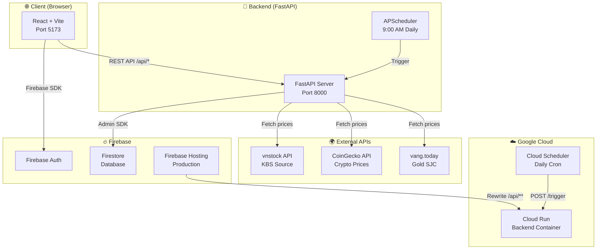
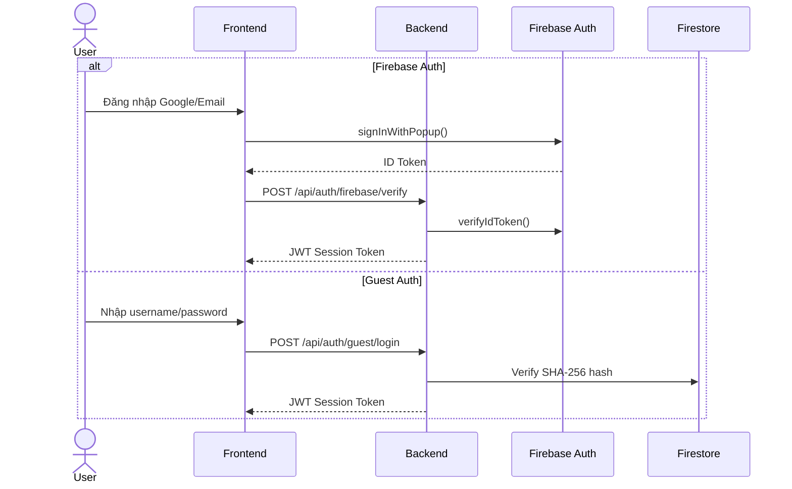
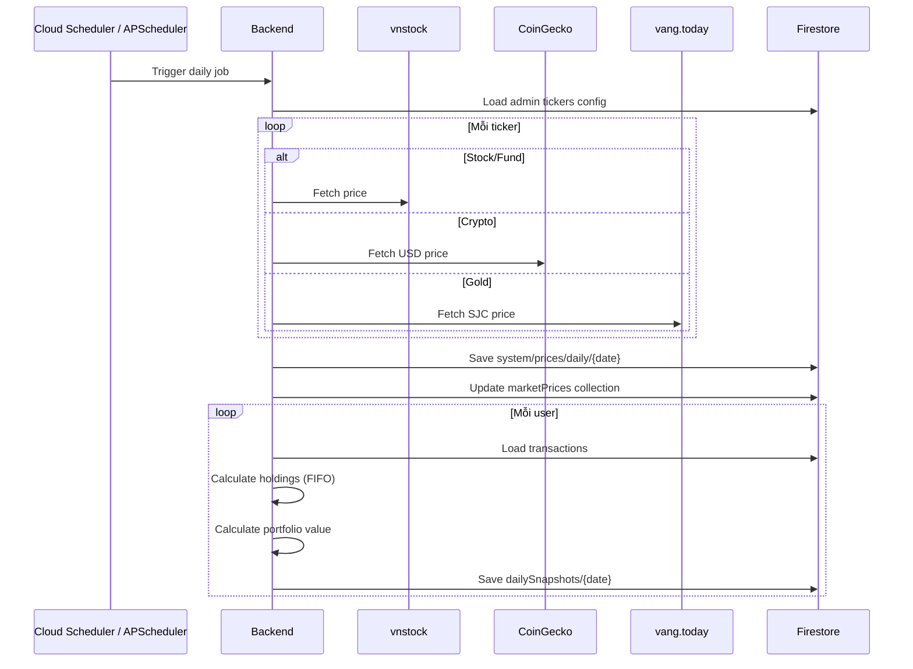

# 🏗️ Architecture Overview — Tổng quan kiến trúc

## Kiến trúc tổng thể



## Chế độ vận hành

Hệ thống hỗ trợ 2 chế độ triển khai:

### 🖥️ Standalone Mode (Local / VPS)

```
DEPLOYMENT_MODE=standalone
```

- Backend chạy trong Docker container với APScheduler tích hợp
- Scheduler tự động chạy lúc 9:00 AM (Asia/Ho_Chi_Minh)
- Frontend serve bởi Vite dev server
- Phù hợp cho phát triển local và VPS

### ☁️ Serverless Mode (Cloud Run)

```
DEPLOYMENT_MODE=serverless
```

- Backend chạy trên Google Cloud Run (scale-to-zero)
- APScheduler **bị tắt** — dùng Google Cloud Scheduler gọi `POST /api/scheduler/trigger`
- Frontend deploy trên Firebase Hosting
- Firebase Hosting rewrite `/api/**` → Cloud Run backend
- Phù hợp cho production, tiết kiệm chi phí

## Luồng dữ liệu chính

### 1. Đăng nhập & Xác thực



### 2. Scheduler — Lấy giá tự động hàng ngày



## Trang liên quan

- [[Architecture Frontend]] — Chi tiết React components
- [[Architecture Backend]] — Chi tiết FastAPI services
- [[Architecture Database]] — Firestore schema
