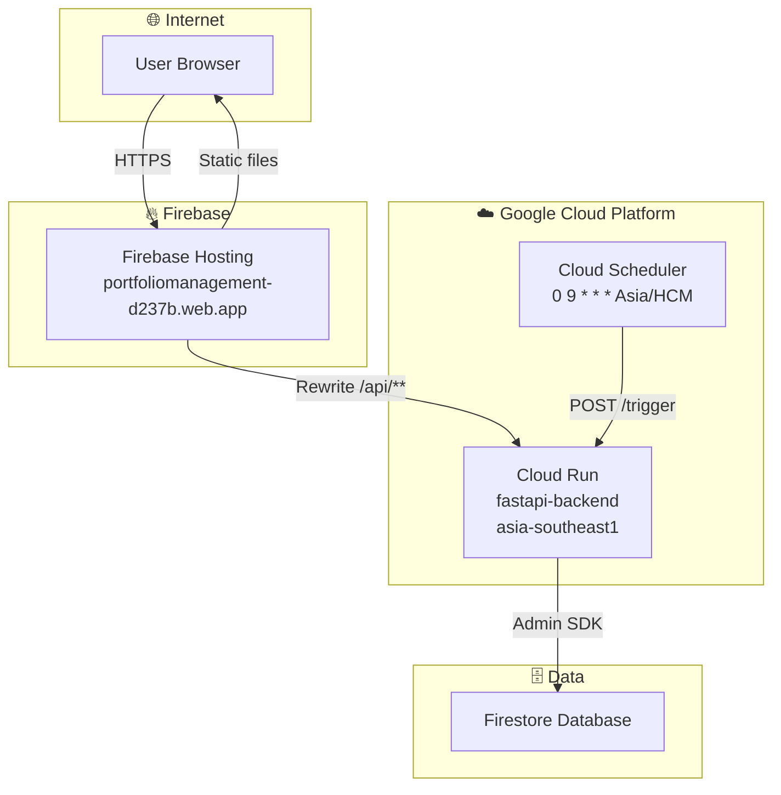

# 🚀 Deployment Guide — Hướng dẫn triển khai Production

> Trang này tóm tắt quy trình deploy. Chi tiết đầy đủ xem tại [DEPLOYMENT_GUIDE.md](https://github.com/huynhphong1611/portfolio_assets_management/blob/main/DEPLOYMENT_GUIDE.md)

## Kiến trúc Production



## Quy trình Deploy lần đầu

| Bước | Hành động | Thời gian |
|:----:|----------|:---------:|
| 1 | Mở Cloud Shell trên Google Cloud Console | 1 phút |
| 2 | Clone code + upload `.env` & service account | 2 phút |
| 3 | Cấp quyền IAM cho Service Account | 1 phút |
| 4 | Deploy Backend → Cloud Run | 2-4 phút |
| 5 | Build Frontend + Deploy → Firebase Hosting | 1 phút |
| 6 | Dọn dẹp file bí mật trên Cloud Shell | 30 giây |
| 7 | Cài đặt Cloud Scheduler (cron 9h sáng) | 2 phút |
| 8 | Kiểm tra toàn bộ hệ thống | 2 phút |

## Deploy Backend (Cloud Run)

```bash
cd backend

# Cách 1: Giữ nguyên env vars cũ (chỉ update code)
gcloud run deploy fastapi-backend \
  --source . \
  --region asia-southeast1 \
  --allow-unauthenticated

# Cách 2: Thêm/sửa env vars (giữ lại vars khác)
gcloud run deploy fastapi-backend \
  --source . \
  --region asia-southeast1 \
  --allow-unauthenticated \
  --update-env-vars="NEW_VAR=value"

# Cách 3: Reset toàn bộ env vars
gcloud run deploy fastapi-backend \
  --source . \
  --region asia-southeast1 \
  --allow-unauthenticated \
  --set-env-vars="DEPLOYMENT_MODE=serverless,JWT_SECRET=xxx,..."
```

## Deploy Frontend (Firebase Hosting)

```bash
# Build
npm run build

# Deploy
firebase deploy --only hosting
```

## Quy trình cập nhật hàng ngày

| Thay đổi | Lệnh |
|----------|------|
| Chỉ Frontend | `npm run build && firebase deploy --only hosting` |
| Chỉ Backend | `cd backend && gcloud run deploy fastapi-backend --source . --region asia-southeast1 --allow-unauthenticated` |
| Cả hai | Deploy Backend trước → Deploy Frontend sau |

## Checklist sau deploy

- [ ] `https://portfoliomanagement-d237b.web.app` — hiện giao diện
- [ ] Đăng nhập thành công
- [ ] `https://portfoliomanagement-d237b.web.app/api/status` → `firebase: ok`
- [ ] Cloud Scheduler **Force Run** → Success
- [ ] Giá cổ phiếu/crypto được cập nhật

---

## Xem thêm

- [[Docker Setup]] — Chạy local bằng Docker
- [[Environment Variables]] — Biến môi trường
- [[Feature Scheduler]] — Cấu hình Cloud Scheduler
- [[Troubleshooting]] — Xử lý sự cố
