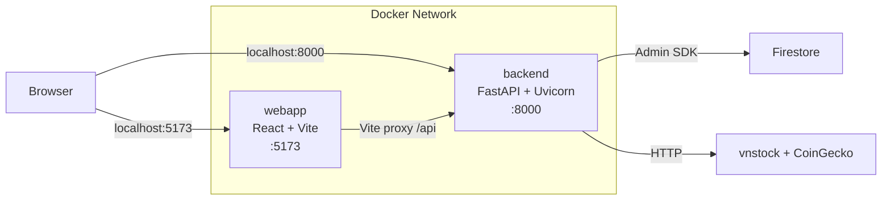

# 🐳 Docker Setup — Cấu hình Docker Local

## Docker Compose Architecture



## Files

| File | Mục đích |
|------|---------|
| `docker-compose.yml` | Orchestration (development) |
| `Dockerfile` | Frontend build (Vite dev server) |
| `backend/Dockerfile` | Backend build (Python + FastAPI) |
| `.dockerignore` | Exclude files từ frontend build context |
| `backend/.dockerignore` | Exclude files từ backend build context |

## docker-compose.yml

```yaml
version: '3.8'

services:
  # ── Frontend ──
  webapp:
    build: .
    ports:
      - "5173:5173"
    volumes:
      - .:/app
      - /app/node_modules         # Tránh ghi đè node_modules
    env_file:
      - .env
    environment:
      - CHOKIDAR_USEPOLLING=true  # Hot reload trong Docker
      - VITE_API_PROXY_TARGET=http://backend:8000
    depends_on:
      - backend

  # ── Backend ──
  backend:
    build: ./backend
    ports:
      - "8000:8000"
    volumes:
      - ./backend:/app
      - ./logs:/app/logs
    env_file:
      - .env
    environment:
      - DEPLOYMENT_MODE=standalone
      - FIREBASE_SERVICE_ACCOUNT_PATH=/app/firebase-service-account.json
    command: uvicorn app.main:app --host 0.0.0.0 --port 8000 --reload
```

## Các lệnh thường dùng

### Build & Run

```bash
# Build và chạy tất cả services
docker compose up -d --build

# Chỉ chạy (không rebuild)
docker compose up -d

# Rebuild một service cụ thể
docker compose build backend
docker compose up -d backend
```

### Monitoring

```bash
# Xem logs realtime
docker compose logs -f backend
docker compose logs -f webapp

# Xem trạng thái containers
docker compose ps

# Xem resource usage
docker stats
```

### Debug

```bash
# Shell vào backend container
docker compose exec backend bash

# Shell vào frontend container
docker compose exec webapp sh

# Test API từ trong container
docker compose exec backend curl http://localhost:8000/api/status
```

### Clean Up

```bash
# Dừng tất cả containers
docker compose down

# Dừng + xoá volumes
docker compose down -v

# Rebuild từ đầu (no cache)
docker compose build --no-cache
docker compose up -d
```

## Vite Proxy Configuration

File `vite.config.js` proxy `/api` requests tới backend container:

```javascript
export default defineConfig({
  server: {
    host: '0.0.0.0',
    port: 5173,
    proxy: {
      '/api': {
        target: 'http://backend:8000',  // Docker service name
        changeOrigin: true,
      },
    },
  },
});
```

## Volume Mounts

| Mount | Mục đích |
|-------|---------|
| `.:/app` (webapp) | Hot reload frontend code |
| `/app/node_modules` (webapp) | Prevent host overwrite |
| `./backend:/app` (backend) | Hot reload backend code |
| `./logs:/app/logs` | Persist backend logs |

## Lưu ý quan trọng

1. **File `.env`** phải tồn tại ở thư mục gốc trước khi `docker compose up`
2. **`firebase-service-account.json`** phải nằm trong `backend/`
3. **DEPLOYMENT_MODE=standalone** — Docker local luôn dùng standalone (có APScheduler)
4. **Hot reload** hoạt động cho cả frontend (Vite) và backend (Uvicorn `--reload`)
5. **Logs** được persist tại `./logs/backend.log` (trên host machine)

---

## Xem thêm

- [[Getting Started]] — Hướng dẫn cài đặt nhanh
- [[Environment Variables]] — Cấu hình biến môi trường
- [[Deployment Guide]] — Deploy lên production
