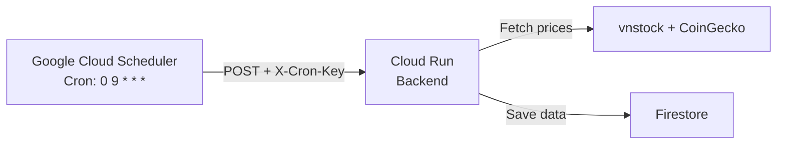
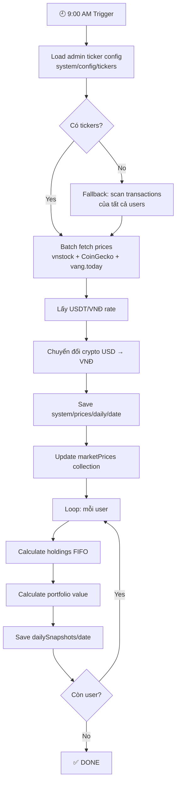

# ⏰ Feature: Scheduler — Lịch trình tự động

## Tổng quan

Scheduler chạy tự động lúc **9:00 AM** hàng ngày (múi giờ Asia/Ho_Chi_Minh) để:

1. Fetch giá mới nhất cho tất cả tickers
2. Lưu giá vào `system/prices/daily/{date}`
3. Cập nhật `marketPrices` collection
4. Tạo snapshot danh mục cho mỗi user

## Hai chế độ vận hành

### 🖥️ Standalone Mode (Local / VPS)

```
DEPLOYMENT_MODE=standalone
```

- Sử dụng **APScheduler** (`BackgroundScheduler`) chạy ngầm trong process FastAPI
- Tự động trigger lúc 9:00 AM
- Trigger thủ công: `POST /api/scheduler/run-now`
- Không cần cấu hình gì thêm

### ☁️ Serverless Mode (Cloud Run)

```
DEPLOYMENT_MODE=serverless
```

- APScheduler **bị tắt hoàn toàn** (vì Cloud Run scale-to-zero)
- Sử dụng **Google Cloud Scheduler** gọi endpoint từ bên ngoài
- Endpoint trigger: `POST /api/scheduler/trigger`
- Xác thực bằng header `X-Cron-Key: <CRON_AUTH_KEY>`



## Luồng xử lý chi tiết



## Always-Fetch Tickers

Dù admin cấu hình gì, scheduler **luôn fetch** các ticker sau:

| Ticker | Lý do |
|--------|-------|
| `USDT` | Tỷ giá VNĐ — cần để chuyển đổi crypto |
| `USDC` | Tỷ giá VNĐ — stablecoin thay thế |
| `GOLD` | Giá vàng SJC — tài sản phổ biến |

## Monitoring

### Kiểm tra trạng thái Scheduler

```bash
# Standalone mode
curl http://localhost:8000/api/scheduler/status

# Response:
{
  "running": true,
  "mode": "standalone",
  "next_run": "2026-05-03 09:00:00+07:00",
  "timezone": "Asia/Ho_Chi_Minh",
  "schedule": "Daily at 09:00"
}
```

### Trigger thủ công

```bash
# Standalone mode
curl -X POST http://localhost:8000/api/scheduler/run-now \
  -H "Authorization: Bearer <JWT>"

# Serverless mode
curl -X POST https://fastapi-backend-xxx.a.run.app/api/scheduler/trigger \
  -H "X-Cron-Key: <CRON_AUTH_KEY>"
```

### Đọc logs

```bash
# Docker
docker compose logs -f backend | grep "SCHEDULER"

# Cloud Run
# → Google Cloud Console → Cloud Run → fastapi-backend → Logs
```

## Cloud Scheduler Configuration

| Field | Value |
|-------|-------|
| **Name** | `portfolio-daily-update` |
| **Region** | `asia-southeast1` |
| **Frequency** | `0 9 * * *` (9:00 AM daily) |
| **Timezone** | `Asia/Ho_Chi_Minh` |
| **Target** | HTTP POST |
| **URL** | Cloud Run service URL + `/api/scheduler/trigger` |
| **Header** | `X-Cron-Key: <CRON_AUTH_KEY>` |
| **Attempt deadline** | `300s` (5 phút) |

> ⚠️ URL phải trỏ **trực tiếp** đến Cloud Run, **KHÔNG** qua Firebase Hosting (timeout chỉ 60s).

---

## Xem thêm

- [[Feature Price Service]] — Engine lấy giá
- [[Feature Snapshot Engine]] — Tạo snapshot
- [[Deployment Guide]] — Cấu hình Cloud Scheduler
- [[Troubleshooting]] — Xử lý sự cố scheduler
